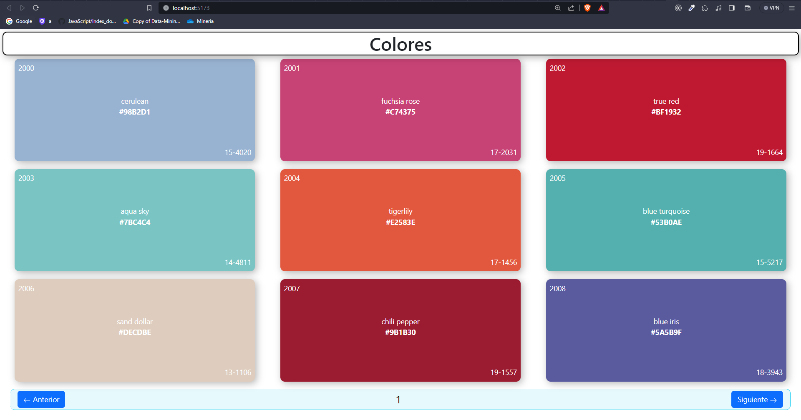

# Colors App 🔴🟠🟡🟢🔵🟣🟤

This page was created to ease access and management by obtaining different standardized colors. With Just one click, a user can get the color in hexadecimal format.

Technologies and Frameworks used:

- **[Yarn]**: Such as node package manager
- **[Vite]**: Such as frontend tool to building fast and optimized web apps
- **[React]**: Such as JavaScript Library
- **[React Hooks]**: To manage the web app global state
- **[Bootstrap]**: Such as CSS Framework
- **[Flex Box]**: To manage the Grid
- **[Animate CSS]**: To animate the different components
- **[Jest]**: As a tool to perform unit testing.

### Installation


To install and work on the Color App:

```bash
git clone https://github.com/E-RI-CK/Colors-App.git
cd Colors-App 
```
Install dependecies:
```bash
yarn install
```
Open Colors-App on Localhost
```bash
yarn dev
```
Open a page in the browser and copy and paste the following:
```bash
http://localhost:5173/
```



[//]: # (These are reference links used in the body of this note and get stripped out when the markdown processor does its job. There is no need to format nicely because it shouldn't be seen.)

   [Yarn]: <https://classic.yarnpkg.com/en/>
   [Vite]: <https://vitejs.dev/>
   [React]: <https://es.react.dev/>
   [React Hooks]: <https://react.dev/reference/react>
   [Bootstrap]: <https://getbootstrap.com/>
   [Flex Box]: <https://css-tricks.com/snippets/css/a-guide-to-flexbox/>
   [Animate CSS]: <https://animate.style/>
   [Jest]: <https://jestjs.io/>
